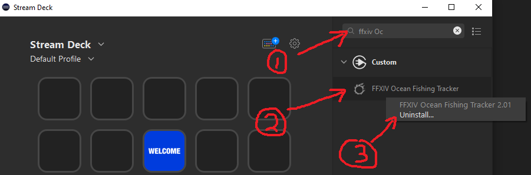

# FFXIV Ocean Fishing Plugin for the Elgato StreamDeck

-----------------------

## NOW UPDATED FOR PATCH 6.4 RUBY ROUTE
[Please refer to Installation section](#installation), **the previous installation must be removed or it won't install properly.**

Note: it is rare but some users may not see a dropdown menu for Routes on first install and initial use. This bug is still being investigated, but may be fixed in v2.02+. A restart typically solves this issue.

-----------------------

StreamDeck is an external LCD key macro device that allows the installation of plugins to improve productivity.

Final Fantasy XIV is a MMORPG video game.

## Description

`FFXIV Ocean Fishing Plugin` can track and display the following:
- Upcoming windows for Blue Fish. (Coral Manta, Stonescale, etc.)
- Upcoming windows for a particular voyage. (Jelly, Shark, etc.)
- Whatever the next voyage is.

For any of the above trackers, you can also select number of windows to skip, to display the "next" window or "next-next" window, and so forth.

You can drag and drop multiple plugins to display more than one tracker if desired.

Tested on Windows 10.

During a possible window to board the boat, the plugin also displays additional text indicating the time left to board. Note that while the text is cut-off in the software image, the StreamDeck hardware can fit the entire line.

Youtube Description: https://www.youtube.com/watch?v=ewgarAlZi5w

## Installation

In the Release folder, you can find the file `com.elgato.ffxivoceanfishing.streamDeckPlugin`. If you double-click this file on your machine, StreamDeck will install the plugin.

[com.elgato.ffxivoceanfishing.streamDeckPlugin](Release/com.elgato.ffxivoceanfishing.streamDeckPlugin)

If an installation was previously present, it must be uninstalled before re-installing. This can be done by right-clicking the plugin name in the Stream Deck right-hand list of plugins, and selecting Uninstall.

The image below shows the steps:

1. Search for the plugin name in Stream Deck application search bar.
2. Right click the plugin name to bring up a menu.
3. Click Uninstall.

Alternatively, delete the plugin folder located in Elgato's AppData folder. For example: `C:\Users\<username>\AppData\Roaming\Elgato\StreamDeck\Plugins`

## Settings

`Title:`

The title is automatically set by the plugin to display the server name and progress percentage.

`Route:`

Select an Ocean Fishing route, such as the Indigo Route or Ruby Route.

`Track by:`

Select either an Achievement, Blue Fish or a Voyage to track. You can also select Next Voyage to display whatever is coming up next. Icons will be dynamically updated.

`Display Time:`

Choose to either display the absolute date of when the window is open, or a countdown timer to that window.

`Skips:`

Select number of windows to skip over. Using different skip numbers across multiple instances of the plugin will allow you to see several upcoming windows.

If set to a non-zero number, the selected value will be displayed in the top-right corner.

In the image below, an example is shown where in the first two rows the next 5 upcoming windows for Coral Manta and Stonescale are shown. The last row shows what the next 5 voyages will be in general.

`Display Priority:`

If tracking by Voyages or by Next Voyage, this option will prioritize displaying either the Achievement or the Blue Fish of that voyage.

Note that if a voyage has no Achievement, it will always just display the Blue Fish for that voyage. Similarly, if the voyage has no Blue Fish, it will fall back to displaying any Achievements in that voyage.

This option has no effect if tracking by Achievements or Blue Fish directly.

`Button URL:`

A custom URL per button can be set such that when the StreamDeck button is pressed, the webpage is opened by the default browser.

By default, the webpage is set to the [Ocean Fishing Spreadsheet](https://docs.google.com/spreadsheets/d/1R0Nt8Ye7EAQtU8CXF1XRRj67iaFpUk1BXeDgt6abxsQ/edit#gid=93698338)

Other suggested links include:

- [Lulu's Tools](https://ffxiv.pf-n.co/ocean-fishing)
- Pastebin notes for macros/instructions for particular achievements/fish

## Source Code

The source code can be found in the [`Sources`](Sources) folder, with plugin specific files found in [`Windows`](Sources/Windows).

The Property Inspector and other associated files can be found in [`com.elgato.ffxivoceanfishing.sdPlugin`](Sources/com.elgato.ffxivoceanfishing.sdPlugin).

General Elgato and 3rd party files are found in [`Common`](Sources/Common) and [`Vendor`](Sources/Vendor).

Fish images are stored in [`Resources`](Sources/Resources), however the files used are rescaled and placed in [`Icons`](Sources/com.elgato.ffxivoceanfishing.sdPlugin/Icons).

To repackage the plugin after compilation, [`repackage.bat`](repackage.bat) uses the included Elgato [distribution tool](DistributionTool.exe), creating the installable in [`Release/com.elgato.ffxivoceanfishing.streamDeckPlugin`](Release/com.elgato.ffxivoceanfishing.streamDeckPlugin).

For development, [`reload.bat`](reload.bat) removes the old installation and re-installs it.

## Developed By

[Momoko Tomoko from Sargatanas](https://na.finalfantasyxiv.com/lodestone/character/1525660/)

