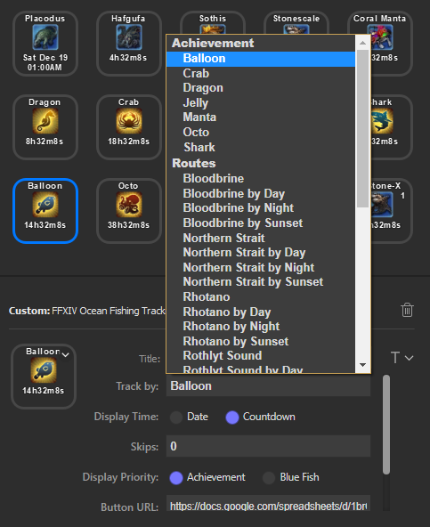

# FFXIV Ocean Fishing Plugin for the Elgato StreamDeck

StreamDeck is an external LCD key macro device that allows the installation of plugins to improve productivity.

Final Fantasy XIV is a MMORPG video game.

## Description

`FFXIV Ocean Fishing Plugin` can track and display the following:
- Upcoming windows for Blue Fish. (Coral Manta, Stonescale, etc.)
- Upcoming windows for a particular Route. (Jelly Route, Shark Route, etc.)
- Whatever the next route is.

For any of the above trackers, you can also select number of windows to skip, to display the "next" window or "next-next" window, and so forth.

You can drag and drop multiple plugins to display more than one tracker if desired.

Tested on Windows 10.

During a possible window to board the boat, the plugin also displays additional text indicating the time left to board. Note that while the text is cut-off in the software image, the StreamDeck hardware can fit the entire line.

## Installation

In the Release folder, you can find the file `com.elgato.ffxivoceanfishing.streamDeckPlugin`. If you double-click this file on your machine, StreamDeck will install the plugin.

[com.elgato.ffxivoceanfishing.streamDeckPlugin](Release/com.elgato.ffxivoceanfishing.streamDeckPlugin)

If an installation was previously present, you must delete the plugin folder located in Elgato's AppData folder. For example: `C:\Users\<username>\AppData\Roaming\Elgato\StreamDeck\Plugins`

## Settings

`Title`

The title is automatically set by the plugin to display the server name and progress percentage.

`Track by:`

Select either a Blue Fish or a Route to track. You can also select Next Route to display whatever is coming up next. Icons will be dynamically updated.

`Display Time:`

Choose to either display the absolute date of when the window is open, or a countdown timer to that window.

`Skips:`

Select number of windows to skip over. Using different skip numbers across multiple instances of the plugin will allow you to see several upcoming windows.

If set to a non-zero number, the selected value will be displayed in the top-right corner.

In the image below, an example is shown where in the first two rows the next 5 upcoming windows for Coral Manta and Stonescale are shown. The last row shows what the next 5 routes will be in general.

`Button URL:`

A custom URL per button can be set such that when the StreamDeck button is pressed, the webpage is opened by the default browser.

By default, the webpage is set to the [Ocean Fishing Spreadsheet](https://docs.google.com/spreadsheets/d/1brCfvmSdYl7RcY9lkgm_ds8uaFqq7qaxOOz-5BfHuuk/htmlview)

## Source Code

The source code can be found in the Sources folder.

## Developed By

[Momoko Tomoko from Sargatanas](https://na.finalfantasyxiv.com/lodestone/character/1525660/)

