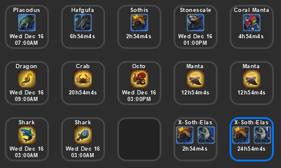
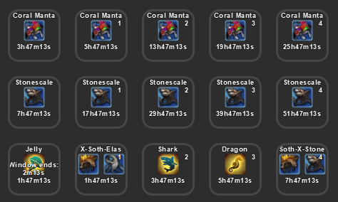

# FFXIV Ocean Fishing Plugin for the Elgato StreamDeck

StreamDeck is an external LCD key macro device that allows the installation of plugins to improve productivity.

Final Fantasy XIV is a MMORPG video game.

## Description

`FFXIV Ocean Fishing Plugin` tracks the next occurance of a selected Blue Fish or a particular Route, and displays either the date or a countdown timer for that window.

You can also select number of windows to skip, to display the "next" window or "next-next" window, and so forth.

You can drag and drop multiple plugins to display more than one tracker if desired.

Tested on Windows 10.

During a possible window to board the boat, the plugin also displays additional text indicating the time left to board. Note that while the text is cut-off in the software image, the StreamDeck hardware can fit the entire line.

## Installation

In the Release folder, you can find the file `com.elgato.ffxivoceanfishing.streamDeckPlugin`. If you double-click this file on your machine, StreamDeck will install the plugin.

Folder: https://github.com/momokotomoko/ffxivStreamDeckFirmamentTrackerPlugin/Release

If an installation was previously present, you must delete the plugin folder located in Elgato's AppData folder. For example: `C:\Users\<username>\AppData\Roaming\Elgato\StreamDeck\Plugins`

## Settings

`Title`

The title is automatically set by the plugin to display the server name and progress percentage.

`Track by:`

Select either a Blue Fish or a Route to track. Icons will be dynamically updated.

`Display Time:`

Choose to either display the absolute date of when the window is open, or a countdown timer to that window.

`Skips:`

Select number of windows to skip over. Using different skip numbers across multiple instances of the plugin will allow you to see several upcoming windows.

If set to a non-zero number, the selected value will be displayed in the top-right corner.

## Source Code

The source code can be found in the Sources folder.

## Developed By

[Momoko Tomoko from Sargatanas](https://na.finalfantasyxiv.com/lodestone/character/1525660/)

